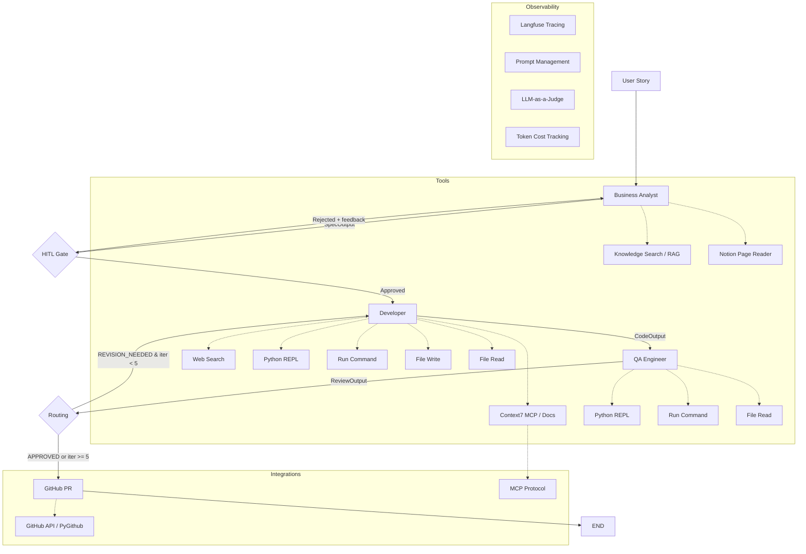

# AI Dev Team — Multi-Agent Software Development System

Multi-agent system simulating an AI software development team using the **Evaluator-Optimizer** pattern. Takes a user story as input, analyzes requirements, generates code, and verifies quality through automated review cycles. Approved code is automatically pushed to GitHub as a pull request.

## Architecture



### Pattern

| Part | Pattern | Description |
|------|---------|-------------|
| User -> BA -> Developer | **Prompt Chaining** | Linear pipeline with HITL gate |
| Developer <-> QA | **Evaluator-Optimizer** | Cyclic review loop, max 5 iterations |
| HITL Gate | **Human-in-the-Loop** | User approves/rejects spec before coding |
| QA -> GitHub | **Post-processing** | Auto-create PR with approved code |

### Agents

| Agent | Role | Model | Tools | Structured Output |
|-------|------|-------|-------|-------------------|
| **Business Analyst** | Analyze user story, produce specification | gpt-4.1-mini | Knowledge Search, Notion Reader | `SpecOutput` |
| **Developer** | Write code, create project files | gpt-5.5 | Web Search, Context7 Docs, Python REPL, Run Command, File I/O | `CodeOutput` |
| **QA Engineer** | Review code, run tests, verify quality | gpt-5.4 | Python REPL, Run Command, File Read | `ReviewOutput` |

## Quick Start

### Prerequisites

- Docker
- OpenAI API key
- Langfuse account (free tier works)
- GitHub token (optional, for PR creation)

### Setup

```bash
cd dev-team

# Configure environment
cp .env.example .env
# Edit .env with your API keys

# Build and run
docker compose build
docker compose up
```

Open **http://localhost:8000** in your browser.

### Docker Commands

```bash
# Run web UI (foreground, with colored logs)
docker compose up

# Run in background
docker compose up -d
docker compose logs -f

# Ingest RAG documents
docker compose --profile tools run --rm ingest

# Run LLM-as-a-Judge tests
docker compose --profile tools run --rm test

# Run interactive CLI
docker compose --profile cli run --rm cli

# Rebuild after code changes
docker compose build && docker compose up
```

## Tools (8 total)

| Tool | Used By | Description |
|------|---------|-------------|
| `knowledge_search` | BA | Hybrid RAG (FAISS + BM25 + cross-encoder reranking) |
| `read_notion_page` | BA | Read user stories from Notion pages |
| `web_search` | Developer | DuckDuckGo search (no API key needed) |
| `docs_search` | Developer | Context7 MCP — up-to-date library documentation |
| `python_repl` | Developer, QA | Sandboxed Python execution (30s timeout, dangerous ops blocked) |
| `run_command` | Developer, QA | Run shell commands in workspace (python, pytest, ls, etc.) |
| `file_write` | Developer | Write files to `workspace/` directory |
| `file_read` | Developer, QA | Read files from `workspace/` directory |

### Context7 MCP Integration

The `docs_search` tool connects to the [Context7](https://context7.com) MCP server via the Model Context Protocol to fetch current library documentation.

1. MCP Python SDK spawns `@upstash/context7-mcp` server
2. Resolves library name to Context7 library ID
3. Queries documentation with the specific question
4. Returns relevant docs and code examples

### GitHub Integration

After QA approval (or max iterations), the pipeline automatically:
1. Creates a branch `dev-team/<spec-title-slug>`
2. Commits all workspace files in a single commit (Git Trees API)
3. Opens a pull request with spec, requirements, and QA review in the body

## Token Optimization

Optimized through iterative profiling with per-call token logging:

- **Model selection**: gpt-5.5 for Dev (better code, fewer calls), gpt-5.4 for QA (thorough reviews), gpt-4.1-mini for BA (cheap spec generation)
- **BA tool reduction**: removed web_search/docs_search from BA — produces specs directly in 1 LLM call (~800 tokens)
- **QA strict process**: "read files → run tests → verdict" in 3 calls, no deviation
- **Dev revision guidance**: reads existing files and patches instead of rewriting from scratch
- **run_command tool**: agents run `python src/main.py` instead of pasting code inline (~10 tokens vs ~400)
- **Token cost logging**: per-step delta tracking with model-aware pricing

### Benchmark

| Metric | v0.1 (baseline) | v2.2 (current) |
|--------|-----------------|----------------|
| BA tokens | 5-9k (5-6 calls) | **~800 (1 call)** |
| Dev tokens | 14-42k (10-13 calls) | **12-18k (3-4 calls)** |
| QA tokens | 25-66k (8 calls) | **11-12k (3 calls)** |
| QA score | 0.30-0.60 (revisions) | **0.95-0.97 (first try)** |
| Total | 43-147k (often crashed) | **24-30k** |
| Cost | $0.12-crash | **$0.10-0.12** |
| Revisions | 1-2+ | **0** |

## Structured Output Contracts

```python
class SpecOutput(BaseModel):
    title: str
    requirements: list[str]
    acceptance_criteria: list[str]
    estimated_complexity: Literal["simple", "medium", "complex"]

class CodeOutput(BaseModel):
    source_code: str = ""  # optional, code is in workspace files
    description: str
    files_created: list[str]

class ReviewOutput(BaseModel):
    verdict: Literal["APPROVED", "REVISION_NEEDED"]
    issues: list[str]
    suggestions: list[str]
    score: float  # 0.0 - 1.0
```

## Observability (Langfuse)

- **Tracing**: Every LLM call logged with input/output, latency, tokens
- **Session tracking**: Grouped by session ID, tagged with user ID
- **Prompt Management**: All system prompts loaded from Langfuse (zero hardcoded)
- **LLM-as-a-Judge**: Automated evaluators score spec/code quality

### Langfuse Prompts

All prompts managed in Langfuse (label: `production`). Upload with `python upload_prompts.py`.

| Prompt Name | Agent | Template Variables |
|-------------|-------|--------------------|
| `ba-prompt` | Business Analyst | — |
| `developer-prompt` | Developer | — |
| `qa-prompt` | QA Engineer | `{{max_iterations}}` |

## LLM-as-a-Judge Tests

| Test | What it checks | Scenario |
|------|---------------|----------|
| `test_ba.py` | Spec completeness | Various user stories -> judge evaluates requirements quality |
| `test_developer.py` | Code matches spec | Calculator spec -> judge checks requirement coverage |
| `test_qa.py` | QA catches bugs | Intentionally bad code -> judge checks QA found issues |
| `test_e2e.py` | Full pipeline | Temperature converter -> end-to-end quality check |

## RAG Knowledge Base

23 documents in `data/`:
- Python stdlib: typing, dataclasses, pathlib, unittest, logging, collections, itertools, functools, contextlib, json, re, argparse, csv, sqlite3, secrets
- PEP 8, Google Python Style Guide
- Design patterns, error handling, abc, async/await, Pydantic
- Flask basics

Run `python ingest.py` to build the FAISS + BM25 hybrid index.

## Project Structure

```
dev-team/
├── main.py                # Interactive CLI + HITL + Langfuse
├── app.py                 # FastAPI web UI with SSE streaming
├── graph.py               # LangGraph StateGraph
├── state.py               # State TypedDict
├── nodes.py               # Node functions (ba, hitl, dev, qa, github)
├── agents/                # BA, Developer, QA agents
├── schemas.py             # Pydantic models
├── tools.py               # 8 @tool functions (incl. Context7 MCP)
├── github_integration.py  # GitHub PR creation via Git Trees API
├── token_tracker.py       # Per-call token usage & cost tracking
├── config.py              # Settings (pydantic-settings)
├── langfuse_prompts.py    # Langfuse prompt loader
├── upload_prompts.py      # Upload prompts to Langfuse
├── retriever.py           # Hybrid RAG retrieval
├── ingest.py              # Document ingestion
├── output_manager.py      # Output packaging with README
├── tests/                 # LLM-as-a-Judge tests (10 tests)
├── data/                  # RAG documents (23 files)
├── index/                 # Persisted FAISS + BM25 (gitignored)
├── workspace/             # Generated code (gitignored)
├── output/                # Final approved code packages + demo requests
├── screenshots/           # Playwright-captured UI screenshots
└── logs/                  # Agent logs with token costs
```

## Environment Variables

```
GITHUB_BASE_BRANCH=main
GITHUB_REPO=owner/repo
GITHUB_TOKEN=ghp_...
LANGFUSE_BASE_URL=https://us.cloud.langfuse.com
LANGFUSE_PUBLIC_KEY=pk-lf-...
LANGFUSE_SECRET_KEY=sk-lf-...
MODEL_FAST=openai:gpt-4.1-mini
MODEL_MID=openai:gpt-5.4
MODEL_POWERFUL=openai:gpt-5.5
OPENAI_API_KEY=sk-...
```

## Tech Stack

- **LangChain** — `create_agent`, `ToolStrategy`, `init_chat_model`
- **LangGraph** — `StateGraph` with conditional edges, `interrupt()` for HITL
- **Langfuse v4** — tracing via `propagate_attributes()`, prompt management
- **MCP** — Model Context Protocol for Context7 docs integration
- **FAISS + BM25** — hybrid retrieval with cross-encoder reranking for RAG
- **PyGithub** — GitHub API, Git Trees for single-commit PRs
- **Pydantic** — structured output contracts
- **FastAPI** — web UI with SSE streaming, colored logs
- **Playwright** — automated UI testing and screenshot capture
- **Ruff** — linting and formatting via pre-commit hooks
