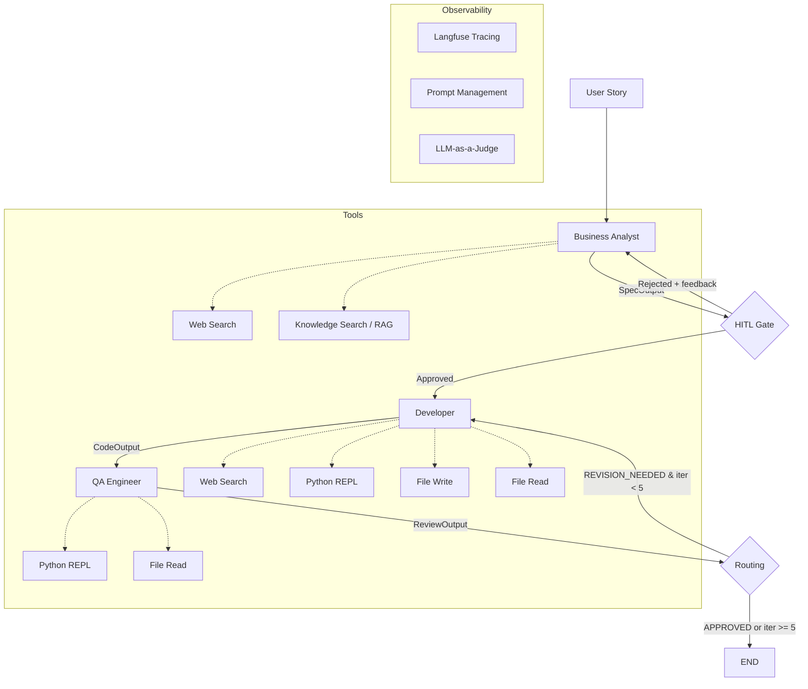

# AI Dev Team — Multi-Agent Software Development System

Multi-agent system simulating an AI software development team using the **Evaluator-Optimizer** pattern. Takes a user story as input, analyzes requirements, generates code, and verifies quality through automated review cycles.

## Architecture



### Pattern

| Part | Pattern | Description |
|------|---------|-------------|
| User -> BA -> Developer | **Prompt Chaining** | Linear pipeline with HITL gate |
| Developer <-> QA | **Evaluator-Optimizer** | Cyclic review loop, max 5 iterations |
| HITL Gate | **Human-in-the-Loop** | User approves/rejects spec before coding |

### Agents

| Agent | Role | Tools | Structured Output |
|-------|------|-------|-------------------|
| **Business Analyst** | Analyze user story, produce specification | Web Search, RAG | `SpecOutput` |
| **Developer** | Write code, create project files | Web Search, Python REPL, File I/O | `CodeOutput` |
| **QA Engineer** | Review code, run tests, verify quality | Python REPL, File Read | `ReviewOutput` |

## Quick Start

### Prerequisites

- Python 3.12+
- OpenAI API key
- Langfuse account (free tier works)

### Setup

```bash
cd dev-team

# Create virtual environment
python -m venv .venv && source .venv/bin/activate

# Install dependencies
pip install -r requirements.txt

# Configure environment
cp .env.example .env
# Edit .env with your API keys

# Ingest RAG documents (optional, for BA's knowledge search)
python ingest.py

# Run
python main.py
```

### Docker

```bash
cd dev-team
docker compose build

# Ingest documents for RAG
docker compose --profile tools run --rm ingest

# Run interactive CLI
docker compose up
```

### Running Tests

```bash
cd dev-team
python -m pytest tests/ -v
```

## Structured Output Contracts

```python
# Business Analyst -> Developer
class SpecOutput:
    title: str
    requirements: list[str]
    acceptance_criteria: list[str]
    estimated_complexity: "simple" | "medium" | "complex"

# Developer -> QA
class CodeOutput:
    source_code: str
    description: str
    files_created: list[str]

# QA -> Developer (or END)
class ReviewOutput:
    verdict: "APPROVED" | "REVISION_NEEDED"
    issues: list[str]
    suggestions: list[str]
    score: float  # 0.0 - 1.0
```

## Observability (Langfuse)

- **Tracing**: Every LLM call logged with input/output, latency, tokens
- **Session tracking**: Grouped by session ID, tagged with user ID
- **Prompt Management**: All system prompts loaded from Langfuse (zero hardcoded)
- **LLM-as-a-Judge**: Automated evaluators score spec/code quality

### Langfuse Prompts

Upload these prompts to Langfuse (label: `production`):

| Prompt Name | Agent | Template Variables |
|-------------|-------|--------------------|
| `ba-prompt` | Business Analyst | — |
| `developer-prompt` | Developer | — |
| `qa-prompt` | QA Engineer | `{{max_iterations}}` |

## LLM-as-a-Judge Tests

| Test | What it checks | Scenario |
|------|---------------|----------|
| `test_ba.py` | Spec completeness | Various user stories -> judge evaluates requirements quality |
| `test_developer.py` | Code matches spec | Calculator spec -> judge checks requirement coverage |
| `test_qa.py` | QA catches bugs | Intentionally bad code -> judge checks QA found issues |
| `test_e2e.py` | Full pipeline | Temperature converter -> end-to-end quality check |

## RAG Knowledge Base

Prepare 10-30 documents in `data/`:
- Python stdlib documentation (.md/.pdf)
- Google Python Style Guide
- Framework tutorials (FastAPI, etc.)
- PEP 8 summary

Run `python ingest.py` to build the FAISS + BM25 hybrid index.

## Project Structure

```
dev-team/
├── main.py              # REPL + HITL + Langfuse
├── graph.py             # LangGraph StateGraph
├── state.py             # State TypedDict
├── nodes.py             # Node functions
├── agents/              # BA, Developer, QA agents
├── schemas.py           # Pydantic models
├── tools.py             # @tool functions
├── config.py            # Settings
├── langfuse_prompts.py  # Langfuse prompt loader
├── retriever.py         # Hybrid RAG retrieval
├── ingest.py            # Document ingestion
├── tests/               # LLM-as-a-Judge tests
├── data/                # RAG documents
├── workspace/           # Generated code (gitignored)
└── screenshots/         # Langfuse UI screenshots
```

## Tech Stack

- **LangChain** — agent creation, tool definitions
- **LangGraph** — StateGraph with conditional edges, HITL interrupts
- **Langfuse** — tracing, prompt management, evaluators
- **FAISS + BM25** — hybrid retrieval for RAG
- **Pydantic** — structured output contracts
- **DuckDuckGo** — web search (no API key needed)
