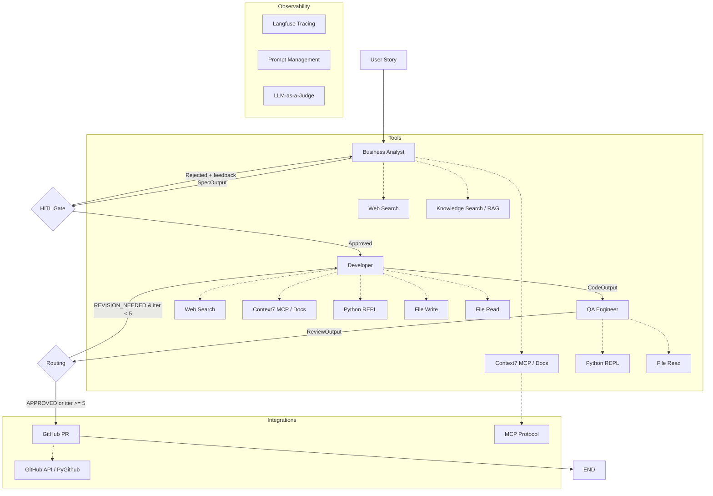

# AI Dev Team — Multi-Agent Software Development System

Multi-agent system simulating an AI software development team using the **Evaluator-Optimizer** pattern. Takes a user story as input, analyzes requirements, generates code, and verifies quality through automated review cycles. Approved code is automatically pushed to GitHub as a pull request.

## Architecture



### Pattern

| Part | Pattern | Description |
|------|---------|-------------|
| User -> BA -> Developer | **Prompt Chaining** | Linear pipeline with HITL gate |
| Developer <-> QA | **Evaluator-Optimizer** | Cyclic review loop, max 5 iterations |
| HITL Gate | **Human-in-the-Loop** | User approves/rejects spec before coding |
| QA -> GitHub | **Post-processing** | Auto-create PR with approved code |

### Agents

| Agent | Role | Model | Tools | Structured Output |
|-------|------|-------|-------|-------------------|
| **Business Analyst** | Analyze user story, produce specification | gpt-4.1-mini | Web Search, RAG, Context7 Docs | `SpecOutput` |
| **Developer** | Write code, create project files | gpt-4.1 | Web Search, Context7 Docs, Python REPL, File I/O | `CodeOutput` |
| **QA Engineer** | Review code, run tests, verify quality | gpt-4.1-mini | Python REPL, File Read | `ReviewOutput` |

## Quick Start

### Prerequisites

- Python 3.12+
- OpenAI API key
- Langfuse account (free tier works)
- GitHub token (optional, for PR creation)

### Setup

```bash
cd dev-team

# Create virtual environment
python -m venv .venv && source .venv/bin/activate

# Install dependencies
pip install -r requirements.txt

# Configure environment
cp .env.example .env
# Edit .env with your API keys

# Ingest RAG documents (optional, for BA's knowledge search)
python ingest.py

# Run
python main.py
```

### Docker

```bash
cd dev-team
docker compose build

# Ingest documents for RAG
docker compose --profile tools run --rm ingest

# Run web UI (http://localhost:8000)
docker compose up

# Run interactive CLI
docker compose --profile cli run --rm cli

# Run tests
docker compose --profile tools run --rm test
```

### Running Tests

```bash
cd dev-team
python -m pytest tests/ -v
```

## Tools

### Agent Tools

| Tool | Used By | Description |
|------|---------|-------------|
| `web_search` | BA, Developer | DuckDuckGo search (no API key needed) |
| `knowledge_search` | BA | Hybrid RAG (FAISS + BM25 + cross-encoder reranking) |
| `docs_search` | BA, Developer | Context7 MCP — up-to-date library documentation |
| `read_notion_page` | BA | Read user stories from Notion pages |
| `python_repl` | Developer, QA | Sandboxed Python execution (30s timeout, dangerous ops blocked) |
| `run_command` | Developer, QA | Run shell commands in workspace (python, pytest, ls, etc.) |
| `file_write` | Developer | Write files to `workspace/` directory |
| `file_read` | Developer, QA | Read files from `workspace/` directory |

### Context7 MCP Integration

The `docs_search` tool connects to the [Context7](https://context7.com) MCP server to fetch current library documentation. Instead of relying on training data, agents can look up exact API signatures, configuration options, and usage examples for any library (Flask, FastAPI, pytest, etc.).

**How it works:**
1. MCP Python SDK spawns the `@upstash/context7-mcp` server
2. Resolves library name to Context7 library ID
3. Queries documentation with the specific question
4. Returns relevant docs and code examples

### GitHub Integration

After QA approval (or max iterations), the pipeline automatically:
1. Creates a branch `dev-team/<spec-title-slug>`
2. Commits all workspace files to the branch
3. Opens a pull request with spec, requirements, and QA review in the body

**Configuration** (optional — leave blank to skip):
```
GITHUB_TOKEN=ghp_...
GITHUB_REPO=owner/repo
GITHUB_BASE_BRANCH=main
```

## Structured Output Contracts

```python
# Business Analyst -> Developer
class SpecOutput:
    title: str
    requirements: list[str]
    acceptance_criteria: list[str]
    estimated_complexity: "simple" | "medium" | "complex"

# Developer -> QA
class CodeOutput:
    source_code: str
    description: str
    files_created: list[str]

# QA -> Developer (or END)
class ReviewOutput:
    verdict: "APPROVED" | "REVISION_NEEDED"
    issues: list[str]
    suggestions: list[str]
    score: float  # 0.0 - 1.0
```

## Observability (Langfuse)

- **Tracing**: Every LLM call logged with input/output, latency, tokens
- **Session tracking**: Grouped by session ID, tagged with user ID
- **Prompt Management**: All system prompts loaded from Langfuse (zero hardcoded)
- **LLM-as-a-Judge**: Automated evaluators score spec/code quality

### Langfuse Prompts

Upload these prompts to Langfuse (label: `production`):

| Prompt Name | Agent | Template Variables |
|-------------|-------|--------------------|
| `ba-prompt` | Business Analyst | — |
| `developer-prompt` | Developer | — |
| `qa-prompt` | QA Engineer | `{{max_iterations}}` |

## Token Optimization

Several optimizations reduce token usage and cost per pipeline run:

- **QA SummarizationMiddleware** — compresses conversation history after 4k tokens, preventing context balloon on tool loops (QA: 25k → 15k tokens, -39%)
- **BA skip-search instruction** — BA produces specs directly for standard Python tasks without unnecessary web/docs searches (BA: 8k → 937 tokens)
- **run_command tool** — agents run `python src/main.py` instead of pasting code inline into python_repl (~10 tokens vs ~400)
- **No duplicate code in QA** — QA reads files via tools only, source_code not sent in prompt
- **Token cost logging** — per-step delta tracking with model-aware pricing

### Benchmark (stack-based calculator)

| Version | BA | Dev | QA | Total | Cost |
|---------|-----|------|------|-------|------|
| v1 (baseline) | ~5k | ~14k | ~25k | 43,515 | $0.117 |
| v4 (optimized) | 936 | 23,305 | 15,220 | 39,461 | $0.111 |

## LLM-as-a-Judge Tests

| Test | What it checks | Scenario |
|------|---------------|----------|
| `test_ba.py` | Spec completeness | Various user stories -> judge evaluates requirements quality |
| `test_developer.py` | Code matches spec | Calculator spec -> judge checks requirement coverage |
| `test_qa.py` | QA catches bugs | Intentionally bad code -> judge checks QA found issues |
| `test_e2e.py` | Full pipeline | Temperature converter -> end-to-end quality check |

## RAG Knowledge Base

18 documents in `data/`:
- Python stdlib docs (typing, dataclasses, pathlib, unittest, logging, collections, itertools, functools, contextlib, json, re)
- PEP 8, Google Python Style Guide
- Design patterns, error handling, abc, async/await, Pydantic

Run `python ingest.py` to build the FAISS + BM25 hybrid index.

## Project Structure

```
dev-team/
├── main.py                # REPL + HITL + Langfuse
├── app.py                 # FastAPI web UI with SSE streaming
├── graph.py               # LangGraph StateGraph
├── state.py               # State TypedDict
├── nodes.py               # Node functions (ba, hitl, dev, qa, github)
├── agents/                # BA, Developer, QA agents
├── schemas.py             # Pydantic models
├── tools.py               # @tool functions (8 tools incl. Context7 MCP)
├── github_integration.py  # GitHub PR creation via Git Trees API
├── token_tracker.py       # Token usage & cost tracking per step
├── config.py              # Settings
├── langfuse_prompts.py    # Langfuse prompt loader
├── retriever.py           # Hybrid RAG retrieval
├── ingest.py              # Document ingestion
├── output_manager.py      # Output packaging
├── tests/                 # LLM-as-a-Judge tests
├── data/                  # RAG documents (18 files)
├── index/                 # Persisted FAISS + BM25 (gitignored)
├── workspace/             # Generated code (gitignored)
├── output/                # Final approved code packages
├── screenshots/           # Playwright-captured UI screenshots
└── logs/                  # Agent logs with token costs
```

## Environment Variables

```
OPENAI_API_KEY=sk-...
LANGFUSE_SECRET_KEY=sk-lf-...
LANGFUSE_PUBLIC_KEY=pk-lf-...
LANGFUSE_BASE_URL=https://us.cloud.langfuse.com
MODEL_POWERFUL=openai:gpt-4.1
MODEL_FAST=openai:gpt-4.1-mini
# Optional
GITHUB_TOKEN=ghp_...
GITHUB_REPO=owner/repo
GITHUB_BASE_BRANCH=main
```

## Tech Stack

- **LangChain** — agent creation, tool definitions
- **LangGraph** — StateGraph with conditional edges, HITL interrupts
- **Langfuse** — tracing, prompt management, evaluators
- **MCP** — Model Context Protocol for Context7 docs integration
- **FAISS + BM25** — hybrid retrieval for RAG
- **PyGithub** — GitHub API for automatic PR creation
- **Pydantic** — structured output contracts
- **FastAPI** — web UI with SSE streaming
- **DuckDuckGo** — web search (no API key needed)
